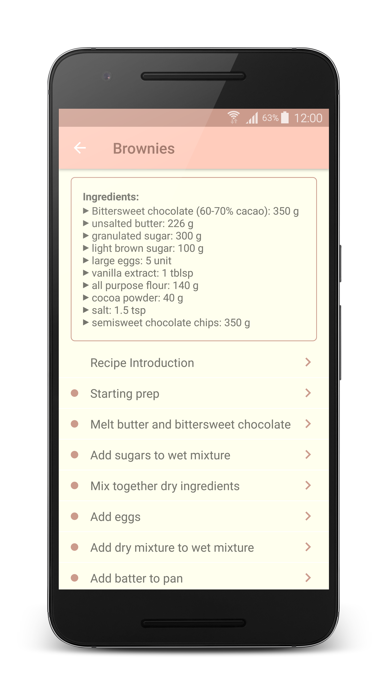
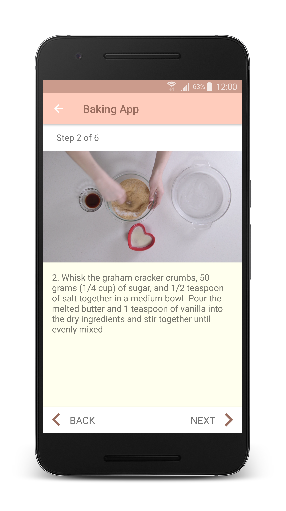

# Baking App 

An app to view video recipes. It is one of the projects for Udacity Android Developer Nanodegree. 

## Features 
- Get fresh recipes to bake something tasty 
- Retrieve old recipes fast - the app uses a Room database to store recipes
- Keep a list of ingredients handy using a homescreen widget
- Enjoy advantages of a tablet's large screen size with a two-pane layout 

## Technical aspects
- MVVM architecture with Android Architecture Components and a use of a repository pattern 
- Dagger 2 for dependency injections
- Fragments for a responsive design that works on phones and tablets
- ExoPlayer to display videos
- Sample UI tests with Espresso and Mockito

## Libraries

* [Android Architecture Components][1] (LiveData, ViewModel, Room)
* [Dagger 2][2]
* [Retrofit][3]
* [Picasso][4]
* [ExoPlayer][5]
* [Espresso][6] and [Mockito][7]

## Screenshots

  
 


License
-------
```
Copyright 2018 [Roman Potapov][8]

Licensed under the Apache License, Version 2.0 (the "License");
you may not use this file except in compliance with the License.
You may obtain a copy of the License at

   http://www.apache.org/licenses/LICENSE-2.0

Unless required by applicable law or agreed to in writing, software
distributed under the License is distributed on an "AS IS" BASIS,
WITHOUT WARRANTIES OR CONDITIONS OF ANY KIND, either express or implied.
See the License for the specific language governing permissions and
limitations under the License.
```

[1]: https://developer.android.com/topic/libraries/architecture
[2]: https://github.com/google/dagger
[3]: https://github.com/square/retrofit
[4]: https://github.com/square/picasso
[5]: https://github.com/google/ExoPlayer
[6]: https://developer.android.com/training/testing/espresso/
[7]: https://github.com/mockito/mockito
[8]: https://www.linkedin.com/in/roman-potapov

